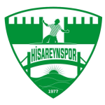

<!doctype html>
<html lang="tr">
<head>
<meta charset="utf-8">
<meta name="viewport" content="width=device-width,initial-scale=1">
<meta name="description" content="Hisareynspor - Kocaeli Gölcük. Kulüp haberleri, altyapı, başarılar ve sosyal medya.">
<title>Hisareynspor | Resmî Kulüp Web Sitesi</title>

</head>
<body>

<section class="hero">
  

    

      
GÖLCÜK • KOCAELİ • 1977

      <h1>Yeşil-beyaz sevda.</h1>
      
Hisareynspor hakkında güncel kulüp haberleri, duyurular ve sosyal medya paylaşımlarının yer aldığı resmî web sitesi.

      

        <a class="btn white" href="#haberler">Güncel Haberler</a>
        <a class="btn ghost" target="_blank" href="https://www.kaskf.org/PuanTablosuDetay">Puan Durumu</a>
        <a class="btn ghost" target="_blank" href="https://news.google.com/search?q=Hisareynspor">Google Haberleri</a>
        <a class="btn ghost" target="_blank" href="https://www.instagram.com/hisareynspor/">Instagram</a>
      

    

    
  

</section>

<section id="facts-sec">
  

    

      
<b>1977</b>Kuruluş yılı

      
<b>Gölcük</b>Kocaeli

      
<b>U14 • U15 • U19</b>2026-27 Gelişim Ligleri

      
<b>U16</b>2022-23 Türkiye 3.'lüğü

    

  

</section>

<section id="basarilar">
  

    

      

        <h2>Öne çıkan kulüp geçmişi</h2>
        
Basında yer alan doğrulanabilir başarı ve gelişim hikâyelerinden seçmeler.

      

    

    

      

        <h3>Altyapıdan profesyonel futbola</h3>
        
Habertürk'ün 2017 tarihli haberinde Hisareynspor'un altyapısından Süper Lig ve TFF 1. Lig ekiplerine oyuncular kazandırıldığı; Kerem Aktürkoğlu dahil çeşitli genç oyuncuların üst düzey kulüplere gönderildiği aktarılıyor.

        <a class="read" target="_blank" href="https://www.haberturk.com/hisareynspor-yeni-yildiz-adaylari-yetistiriyor-1722753-spor">Habertürk kaynağı →</a>
      

      

        <h3>Türkiye'nin en başarılı amatör kulübü</h3>
        
Kocaeli Gazetesi, Hisareynspor'un 2022-2023 sezonunda Türkiye Amatör Spor Kulüpleri Konfederasyonu tarafından en başarılı amatör kulüp seçildiğini haberleştirdi.

        <a class="read" target="_blank" href="https://www.kocaeligazetesi.com.tr/haber/17390349/hisareyn-en-basarili-amator-kulup-secildi">Kocaeli Gazetesi kaynağı →</a>
      

    

  

</section>

<section id="sosyal" style="background:#edf5f0">
  

    

      

        <h2>Resmî ve önemli bağlantılar</h2>
        
Güncel paylaşım ve kulüp bilgileri için doğrudan kaynaklara ulaşın.

      

    

    

      <a class="soc" target="_blank" href="https://www.kaskf.org/PuanTablosuDetay">KASKF Puan Durumu<small>Kocaeli Amatör Spor Kulüpleri Federasyonu</small></a>
      <a class="soc" target="_blank" href="https://www.tff.org/Default.aspx?kulupId=4424&pageId=28">TFF<small>Türkiye Futbol Federasyonu kulüp bilgileri</small></a>
    

  

</section>

<footer>
  

    
Bu site Hisareynspor Kulübü Resmî Web Sitesidir. Tüm hakları saklıdır. &copy;  Hisareynspor Kulübü

  

</footer>

</body>
</html>
